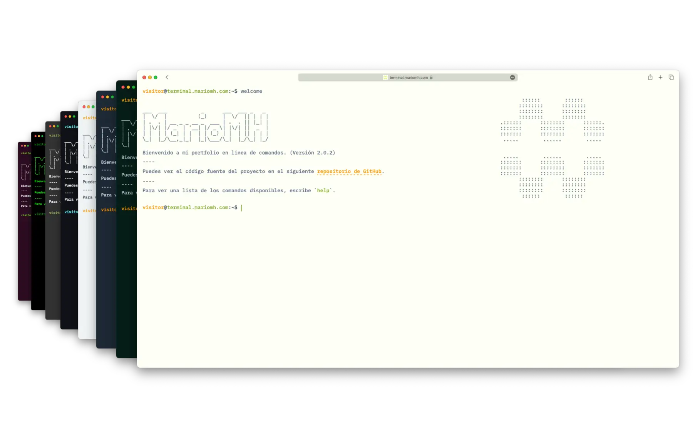

<h1 align="center">
  terminal.mariomh.com
</h1>

<p align="center">
    Portfolio personal en formato terminal
</p>



## Características

- 📱 Diseño responsive
- 🎨 Soporte para múltiples temas
- ✨ Autocompletado de comandos (TAB | Ctrl + i)
- ⬆️ Ir al comando anterior y siguiente
- 📖 Ver el historial de comandos
- 🔥 PWA y soporte offline
- 🇬🇧 Soporte para inglés y 🇪🇸 español

## Tecnologías

- **Runtime** - [Bun](https://bun.sh)
- **Frontend** - [Astro](https://astro.build/), [Preact](https://preactjs.com/)
- **Styling** - Plain CSS
- **Deployment** - [Firebase](https://firebase.google.com/)
- **Languages** - [TypeScript](https://www.typescriptlang.org/)
- **State Management** - [nanostores](https://github.com/nanostores/nanostores)

## Puntuación Lighthouse


## Ejecutar proyecto

Clonar el proyecto

```bash
git clone https://github.com/MarioMH8/terminal.mariomh.com.git
```

Acceder al directorio del proyecto

```bash
cd terminal.mariomh.com
```

Instalar dependencias

```bash
bun install
```

Ejecutar servidor

```bash
bun dev
```

## Desplegar proyecto

Accede a la GitHub Action [Deploy to Firebase](https://github.com/MarioMH8/terminal.mariomh.com/actions/workflows/firebase-deploy.yml) y ejecuta el workflow.

## Estructura del proyecto

El proyecto está organizado en varios directorios y archivos principales:

- `src/`: Este directorio contiene todo el código fuente del proyecto.
  - `components/`: Contiene los componentes específicos del proyecto.
  - `layouts/`: Contiene el layout base de la página.
  - `pages/`: Contiene los componentes de Astro que representan las páginas de la aplicación.
  - `styles/`: Contiene los estilos globales de la aplicación.
- `public/`: Este directorio contiene todos los archivos estáticos.

## Inspiración y créditos

Aquí hay algunas inspiraciones para este tipo de sitio web de terminal.
Solo algunas características y funcionalidades están inspiradas en los siguientes sitios web.
Todo el código está escrito por mi cuenta.

- [Terminal Portfolio by Sat Naing](https://terminal.satnaing.dev/)
- [term m4tt72](https://term.m4tt72.com/)
- [Forrest](https://fkcodes.com/)
